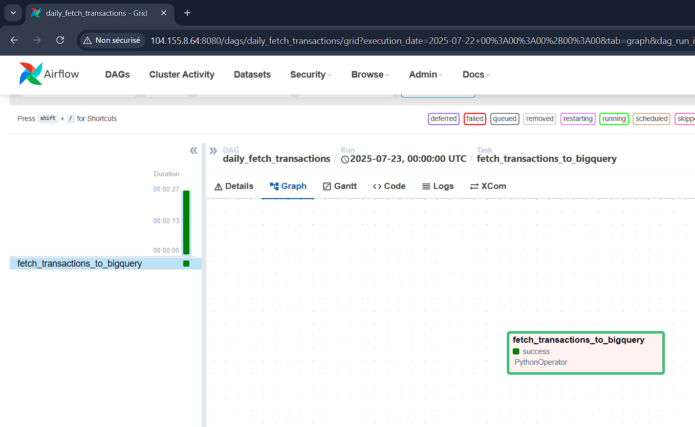
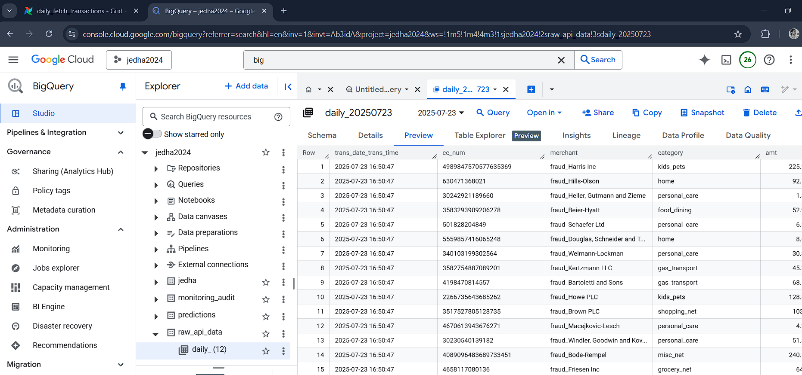
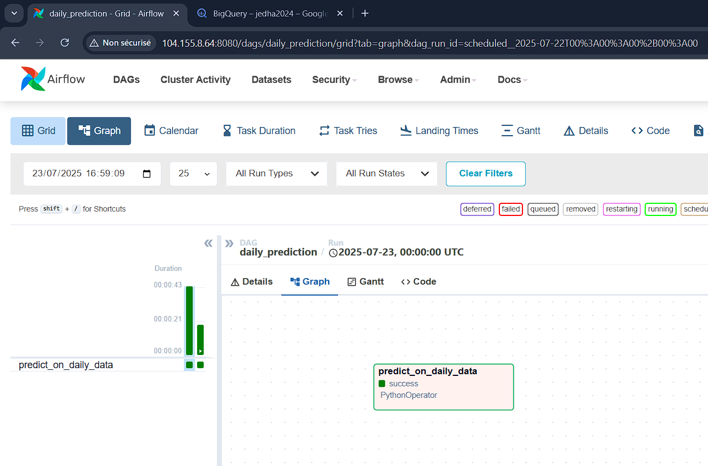
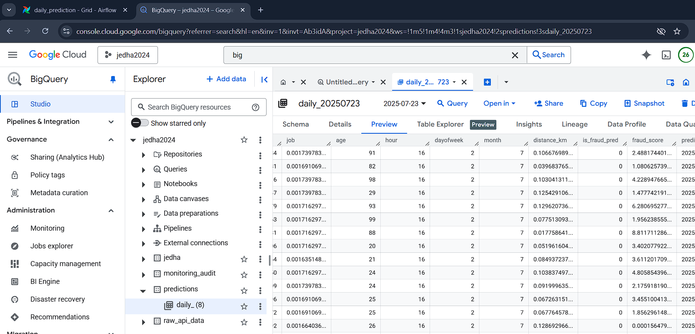

# 🛠️ Airflow DAGs – Fraud Detection Pipeline

This documentation explains the **Airflow DAGs** that orchestrate ingestion, prediction, monitoring, and retraining in the fraud detection system.

---

## 🧩 DAG Overview

| DAG Name                   | Purpose                          | Trigger          |
| -------------------------- | -------------------------------- | ---------------- |
| `daily_fetch_transactions` | Ingest synthetic transactions    | Daily @ midnight |
| `daily_prediction`         | Preprocess & predict on raw data | Daily @ 1AM      |
| `daily_monitoring`         | Detect drift & retrain if needed | Daily @ 2AM      |

---

## 1️⃣ `daily_fetch_transactions`

### 🎯 Purpose

Fetch synthetic transaction data from the `mock-api` and store in BigQuery.

### 🔧 Tasks

* `fetch_transactions_to_bigquery`

  * Calls `/transactions?n=500&variability=X`
  * Saves to: `raw_api_data.daily_YYYYMMDD`
  * Resets table if `RESET_BQ=true`

### 📷 Visuals

**DAG done in Airflow**

**Result in BigQuery**

---

## 2️⃣ `daily_prediction`

### 🎯 Purpose

Run preprocessing and model prediction on newly ingested data.

### 🔧 Tasks

* `predict_on_daily_data`

  * Loads data from BigQuery
  * Calls `/preprocess_direct` for cleaning
  * Calls `/predict` for fraud scoring
  * Saves results to: `predictions.daily_YYYYMMDD`

### 📷 Visuals

**DAG done in Airflow**

**Result in BigQuery**

---

## 3️⃣ `daily_monitoring`

### 🎯 Purpose

Detect drift or performance drop and retrain model if needed.

### 🔧 Tasks

1. `monitor_drift_report` → `/monitor`
2. `validate_model` → `/validate`
3. `decide_if_retrain` → branching
4. `retrain_model` → `/train` (fine-tune)
5. `end_monitoring` → logs summary + alerts

### 🔔 Conditions

* Drift → trigger retrain
* AUC < 0.90 → trigger retrain
* Success → update model + send notification

### 📷 Visuals

**DAG done in Airflow**

TODO

**Result in BigQuery**

TODO

**Alerting in Discord: drift/retrain alert**

TODO

**Alerting in Discord: retraining success**

TODO

---

## 📦 BigQuery Tables Used

| Table                         | Description                           |
| ----------------------------- | ------------------------------------- |
| `raw_api_data.daily_YYYYMMDD` | Raw ingested transactions             |
| `predictions.daily_YYYYMMDD`  | Model predictions                     |
| `monitoring_audit.logs`       | Logs drift flags, AUC, retrain status |

---

## 🔄 DAG Intervals Summary

| DAG                        | Schedule | Trigger Type              |
| -------------------------- | -------- | ------------------------- |
| `daily_fetch_transactions` | @daily   | Time-based                |
| `daily_prediction`         | @daily   | Time-based                |
| `daily_monitoring`         | @daily   | Time-based or event-based |