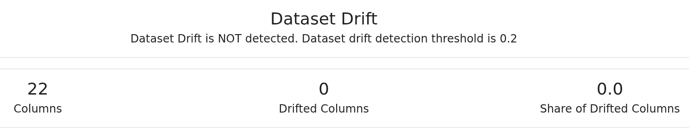
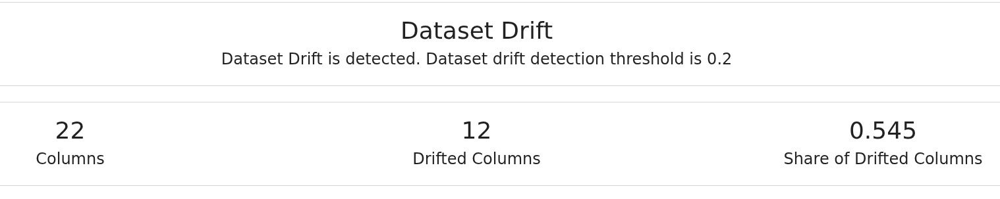
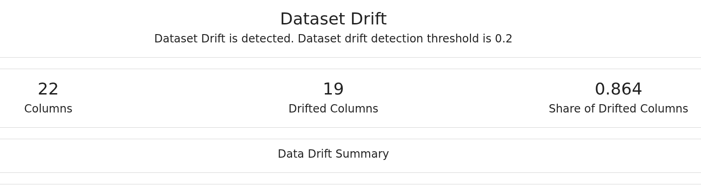

# 🧪 Data Drift Testing Workflow with FastAPI, Airflow & Evidently

This document outlines the architecture and workflow to simulate, ingest, and evaluate data drift in transactional datasets using a FastAPI-based mock server, an Airflow ingestion DAG, and a comparison script leveraging **Evidently**.

---

## 1. 🎭 Synthetic Transaction Generator API (FastAPI)

### 📌 Objective

Provide controlled mock datasets simulating various degrees of variability (or "drift") compared to a static real-world base.

### 📊 Dataset Overview

The synthetic transaction generator is based on a **fraud detection dataset** with **555,719 entries** and **23 columns**:

| Column | Type | Description |
|--------|------|-------------|
| `trans_date_trans_time` | object | Transaction timestamp |
| `cc_num` | int64 | Credit card number |
| `merchant` | object | Merchant name |
| `category` | object | Transaction category |
| `amt` | float64 | Transaction amount |
| `first`, `last` | object | Customer first/last name |
| `gender` | object | Customer gender (M/F) |
| `street`, `city`, `state`, `zip` | object/int64 | Address components |
| `lat`, `long` | float64 | Customer location coordinates |
| `city_pop` | int64 | City population |
| `job` | object | Customer occupation |
| `dob` | object | Date of birth |
| `trans_num` | object | Unique transaction identifier |
| `unix_time` | int64 | Transaction timestamp (Unix) |
| `merch_lat`, `merch_long` | float64 | Merchant location coordinates |
| `is_fraud` | int64 | Fraud label (0/1) |

**Sample transaction data:**

| Field | Transaction 1 | Transaction 2 |
|-------|---------------|---------------|
| **trans_date_trans_time** | 2020-06-21 12:14:25 | 2020-06-21 12:14:33 |
| **cc_num** | 2291163933867244 | 3573030041201292 |
| **merchant** | fraud_Kirlin and Sons | fraud_Sporer-Keebler |
| **category** | personal_care | personal_care |
| **amt** | 2.86 | 29.84 |
| **first, last** | Jeff Elliott | Joanne Williams |
| **gender** | M | F |
| **city, state, zip** | Columbia, SC, 29209 | Altonah, UT, 84002 |
| **lat, long** | 33.9659, -80.9355 | 40.3207, -110.436 |
| **city_pop** | 333,497 | 302 |
| **job** | Mechanical engineer | Sales professional, IT |
| **dob** | 1968-03-19 | 1990-01-17 |
| **is_fraud** | 0 | 0 |

### ✅ Features

* Serves endpoints to return transaction data at different **variability levels**:

  * `variability = 0.0` → deterministic, sampled directly from real CSV (no drift).
  
  * `variability = 0.5` → moderate drift through perturbed attributes.
  
  * `variability = 1.0` → high synthetic randomness (max drift).
  

### ✅ Synthetic Data Generation

The API generates realistic synthetic data by maintaining **semantic consistency** and **distributional realism** (statistical properties match real-world patterns).

**How it works:**

* **🎯 Controlled Perturbations**: For numerical fields like `lat`/`long` coordinates and `city_pop`, the generator adds small random variations around the original values. This simulates natural data drift while keeping values geographically and demographically realistic.

* **📊 Distribution Sampling**: For categorical fields like `gender` and `job`, the system maintains frequency profiles from the original dataset (e.g., 60% male, 40% female). New synthetic records are sampled according to these learned distributions, preserving the natural balance of categories.

* **🔄 Dynamic Generation**: Each synthetic transaction gets:
  - A **unique UUID-based `trans_num`** (preventing duplicates)
  - **Updated timestamps** (reflecting current ingestion time)
  - **Correlated merchant coordinates** (`merch_lat`/`merch_long` near customer location)

This approach ensures that synthetic data at `variability=0.0` is identical to the original, while `variability=1.0` introduces maximum realistic variation without breaking business logic.

### 🧬 Structure

```bash
GET /transactions?n=500&variability=0.5
```

Returns a list of `Transaction` Pydantic models matching your fraud detection schema.

---

## 2. ⛓️ Data Ingestion via Airflow DAG

### 📌 Objective

Ingest synthetic data from the API into BigQuery daily with dynamic table naming and optional overwrite.

### ✅ Features

* Daily execution with `@daily` schedule.
* Uses `.env` or environment flags:

  * `ENV=DEV|PROD`
  * `RESET_BQ_BEFORE_WRITE=true` to optionally clear existing tables before upload.
  * `FETCH_VARIABILITY=0.0|0.5|1.0`
* Writes to table:

  ```
  {BQ_PROJECT}.{BQ_DATASET}.daily_YYYYMMDD
  ```

### 🧱 Code Behavior

* Pulls JSON from API.
* Appends ingestion timestamp.
* Pushes to BigQuery using `pandas.to_gbq`.

---

## 3. 🔍 Data Drift Comparison & Report

### 📌 Objective

Compare the new BQ-ingested data against a reference dataset (`fraudTest.csv`) using **Evidently**.

### ✅ Pipeline Steps

1. **Load reference & current** datasets.
2. **Align columns** and drop BigQuery-only (`ingestion_ts`).
3. **Sample reference** with same number of rows.
4. **Force column types** for consistency (e.g. `zip`, `cc_num` as int).
5. **Drop empty or type-mismatched columns**.
6. **Hash snapshot** of data to confirm differences (or not).
7. **Generate Evidently report** using `DataDriftPreset`.

### 📍 Outputs

* Drift report: `shared_data/evidently_drift_report.html`
* Console diagnostics:

  * Hash delta
  * Dropped/converted columns
  * Column types confirmed or mismatched

---

## 4. 📊 Sample Results by Variability

| Variability | Drifted Columns | Drift Share | Interpretation                           |
| ----------- | --------------- | ----------- | ---------------------------------------- |
| `0.0`       | 0               | 0.0         | Identical to ref (no drift) ✅            |
| `0.5`       | 12              | 54.5%       | Moderate drift introduced                |
| `1.0`       | 19              | 86.4%       | Maximum variability (fully synthetic) 🔥 |

📸 Visual outputs from Evidently confirm that drift metrics correlate cleanly with the configured `variability` level.

---

## ✅ Summary

This pipeline is a full-stack simulation, ingestion, and monitoring solution for **data drift detection**. It enables rapid experimentation across multiple synthetic scenarios with realistic controls and BigQuery integration.
